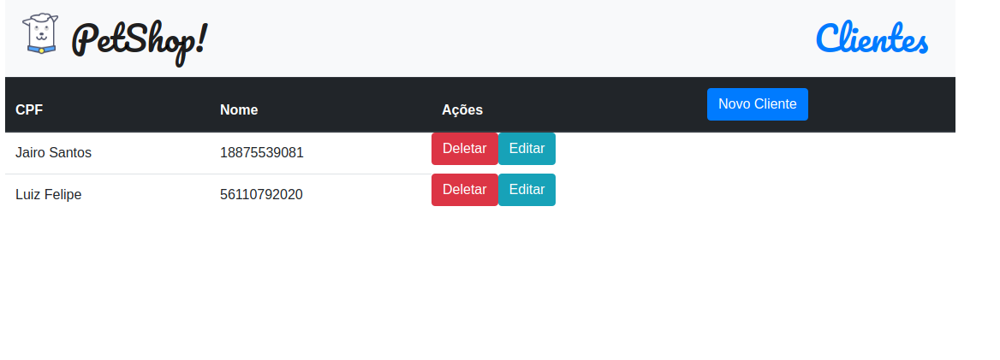

# Consumindo uma API com Fetch
> **_Status do projeto:_** Finalizado :heavy_check_mark:

## Preview




## Descrição

Projeto desenvolvido durante o curso [Fetch API: Consumindo uma API Rest com JavaScript
](https://cursos.alura.com.br/course/api-rest-javascript).

Neste projeto/curso é utilizado uma API local para realizar um CRUD basico utilizando Fetch.


## Tecnologias utilizadas
* HTML
* CSS
* JS

## Como rodar a aplicação  :arrow_forward:

Clone o repositorio:
```
git clone https://github.com/filiphis/consumindo-api-rest-javascript
```

Acesse a pasta do projeto:
```
cd consumindo-api-rest-javascript
```

Acesse a pasta do servidor :
```
cd server-petshop
```

Instale as dependencias para rodar a API:
```
npm install
```

Execute o servidor:
```
npm start
```

Com o servidor rodando, abra o arquivo **index.html** em seu navegador favorito. 
 Pronto, visualize o projeto :open_mouth: :satisfied:

